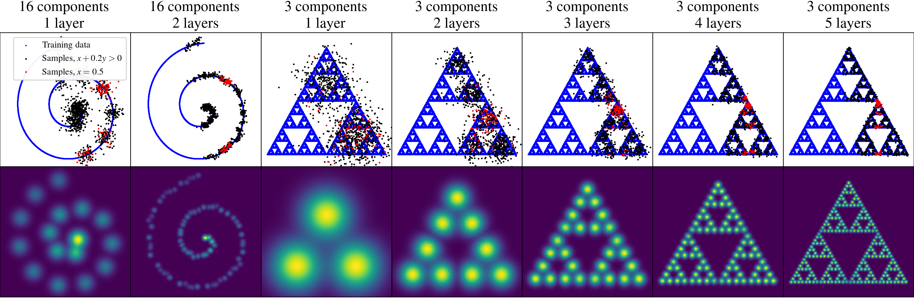
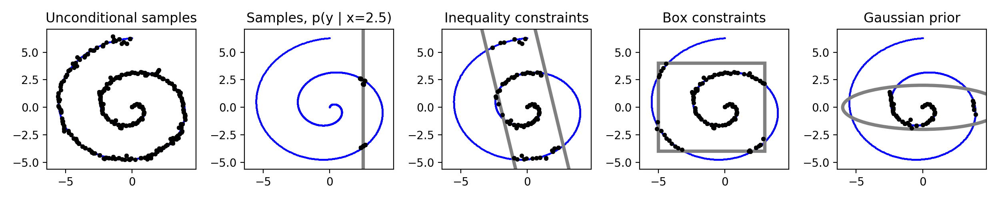
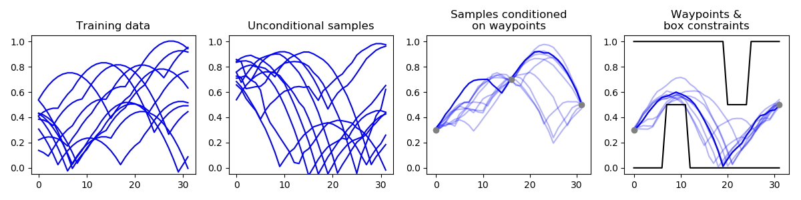
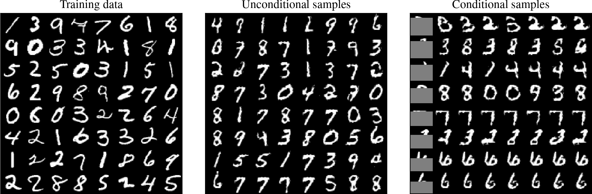

# Deep Residual Mixture Models


Code for the paper [Deep Residual Mixture Models](https://arxiv.org/abs/2006.12063). DRMM is a deep generative model that allows uniquely versatile sample conditioning. Basically, one can **train once, then infer anything from anything**. More precisely, one can sample any variable(s) conditioned on any other variable(s) and/or additional priors and constraints. This is useful for **interactive machine learning**, allowing a user to adjust the sampling without retraining the model. In contrast, common generative models like GANs and VAEs require one to specify the conditioning variables during training.

For example, a DRMM can do:

* *Image completion/inpainting*: Train with images, then sample pixels conditional on other pixels.
* *Movement planning*: Train with random movement trajectories, sample trajectories conditional on obstacles and one or more target states, e.g., animation keyframes.
* *Constrained inverse kinematics*: Train with random body poses, sample joint angles based on any number of goals and inequalities, e.g., hand reaching for a target while head being below some obstacle.

As shown in the figure above, a DRMM also does density estimation, and the number of modeled density modes grows exponentially with depth (in a best-case scenario with suitably self-similar data like the Sierpinski triangle). This emerges from stacking elementary mixture model layers with novel residual skip-connections and latent variable augmentation.  

The following tutorials should get one started. To use DRMM, you only need to add a single Python file to your project: [DRMM.py](DRMM.py).

## Tutorial 1: 2D data
[Tutorial_Swissroll.py](Tutorial_Swissroll.py) showcases all supported priors and constraints with simple 2D data that is easy to visualize. To run in browser, use this [Colab Notebook](https://colab.research.google.com/github/PerttuHamalainen/DRMM/blob/master/Tutorial_Swissroll.ipynb).




## Tutorial 2: Movement planning (sequential data)
[Tutorial_Sequential.py](Tutorial_Sequential.py) shows how to train with random movement sequences and sample new sequences so that the agent avoids obstacles and goes through desired movement states at desired times. For simple visualization, we use an "air jumping" dynamics model similar to the game Flappy Bird.




## Tutorial 3: Image completion
[Tutorial_Images.py](Tutorial_Images.py) shows how to train with images and sample unknown (masked) pixels. Note that DRMM's quality in this application doesn't (yet) compete with dedicated image completion models such as [DeepFill](https://github.com/JiahuiYu/generative_inpainting).



The video below shows the same with time-varying known pixels mask:

<a href="http://www.youtube.com/watch?feature=player_embedded&v=rBTFTZCZKZE
" ></a>

## Installation

Clone or download the repository. Create and activate a fresh Anaconda Python 3.6 virtual environment and type "pip install -r requirements.txt". NOTE: the code may also work on some other Tensorflow 1 version, but requirements.txt specifies a combination of packages with which we have tested everything.

The code has been tested on Python 3.6.2 and Windows 10 (CPU: Intel Core i7, 16GB, GPU: GTX 1060, 6GB). <!-- except for the Quick! Draw dataset preprocessing (rasterization) code that only works on Linux. On Windows 10, one gets .dll errors that we have not yet managed to sort out.-->

## Citation
If you use DRMM, please cite the paper:

```
@article{hamalainen2020deep,
  title={Deep Residual Mixture Models},
  author={H{\"a}m{\"a}l{\"a}inen, Perttu and Solin, Arno},
  journal={arXiv preprint arXiv:2006.12063},
  year={2020}
}
```
