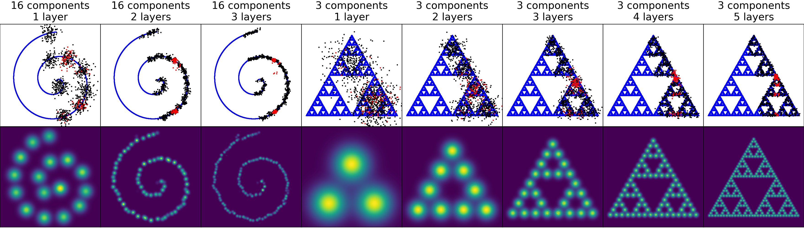
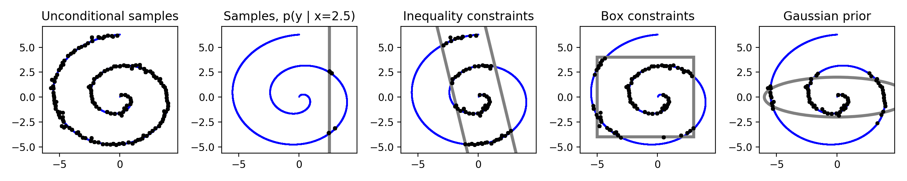

# Deep Residual Mixture Models


Code for the paper [Deep Residual Mixture Models](https://arxiv.org/abs/2006.12063). DRMM is a deep generative model that allows highly versatile sample conditioning. After training once with some dataset, one can sample any variable(s) conditioned on any other variable(s) and/or additional Gaussian priors and inequality constraints. This is useful for **interactive and exploratory machine learning**, allowing a user to adjust the sampling without retraining the model. In contrast, common generative models like GANs and VAEs require one to specify the conditioning variables during training. We demonstrate DRMM in constrained multi-limb inverse kinematics (IK) and controllable generation of animations.

## Installation

Create and activate a fresh Anaconda Python 3.6 virtual environment and type ```pip install -r requirements.txt```.


The code has been tested on Python 3.6.2 and Windows 10 (CPU: Intel Core i9, 32GB, GPU: GTX 2080, (GB).
## Tutorial
To use DRMM, you should only need to add DRMM.py to your project. Note that the file also contains some work-in-progress code not used in this paper submission.

[Tutorial_Swissroll.py](Tutorial_Swissroll.py) showcases all supported priors and constraints with simple 2D data that is easy to visualize. The code should be reasonably well commented.




## Reproducing paper figures and results
[GenerateAll.py](GenerateAll.py) generates paper figures and results, creating folders for them. Paper figures are saved to the "images" folder, including 10 generations of the IK results with different random seeds. Animation video frames are saved in the "imagetemp" folder. These can be viewed as such or rendered as video using a tool such as ffmpeg.

Use ```python GenerateAll.py --quicktest``` to test everything in about 20 minutes with low-quality training settings.  Without the ```--quicktest``` flag, GenerateAll.py will take about a day to complete.

See the comments in GenerateAll.py for more info. If you want to experiment with the individual scripts like Plot_IK.py without retraining the model, run the scripts without the ```--train``` flag.

## Motion data
Currently, we have included the Ubisoft LaForge data subset we used in our experiments. A future release will replace this with tools for downloading the whole dataset and preprocessing and training on any subset of motion data sequences.

## Previous versions
This version, corresponding to paper v3 in arxiv, omits the "backward sampling" examples of the v2 paper. Those were cut because the v3 paper was submitted to a venue with a more strict page limit. The v2 paper's code can be accessed through [this tagged version](https://github.com/PerttuHamalainen/DRMM/releases/tag/arxiv-v2).
